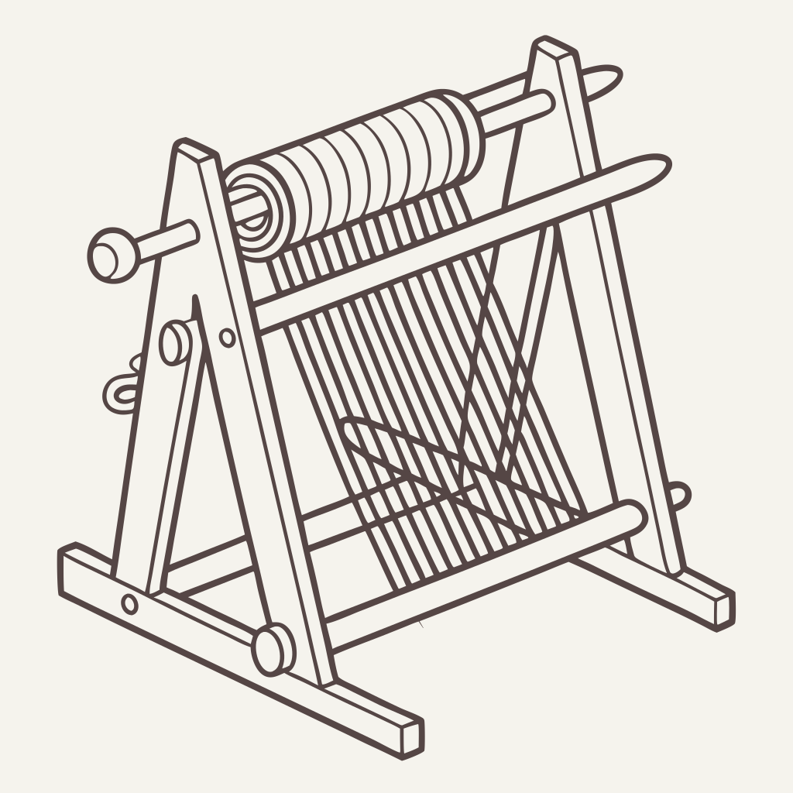

# Loom: A Personal Information & Memory System

  

Loom is a privacy-focused, local-first system for memory augmentation and personal analytics. It automatically captures and contextualizes your digital life, helping you remember important moments, track patterns, and gain insights from your daily activities.

## Overview

Born from experiences with tools like Roam, Obsidian, Logseq, and Notion, Loom goes beyond traditional note-taking to capture both information and its surrounding context. Whether it's documenting important conversations, tracking health habits, or providing legal protection, Loom serves as your personal memory system.

### Real-World Applications

- **Legal Protection**: Automatic detection and transcription of important encounters
- **Time Management**: Smart reminders based on context (e.g., parking meter tracking)
- **Health Tracking**: Pattern recognition in daily habits and routines
- **Meeting Documentation**: Automated capture of conversation context and key points

## Technical Architecture

### Core Stack (V2)
- **Frontend/Backend**: Rust with Tauri for cross-platform support
- **Database**: DuckDB with vector extensions for efficient data storage and retrieval
- **Architecture**: Local-first design prioritizing privacy and performance

### Key Features

- **Automated Context Capture**
  - Real-time audio event detection and classification
  - Location tracking with privacy controls
  - Device metrics monitoring (accelerometer, battery usage, etc.)
  - Continuous audio transcription for important moments
  
- **Smart Processing**
  - Edge device computation for privacy
  - Pattern recognition across multiple data sources
  - Contextual awareness for relevant notifications
  - Historical data analysis for insights

## Getting Started
(wip)
1. Install [bun](https://bun.sh/)
2. Install [rust](https://www.rust-lang.org/tools/install)
3. Clone
4. `bun install`
5. `cd src-tauri` and `bun run tauri dev` (desktop app)

## Privacy & Security

Loom is designed with privacy as a core principle:
- All data processing happens locally on your device
- No cloud dependencies or external tracking
- Full control over what data is collected and stored
- Option to encrypt sensitive information

## Development Status

This project is actively under development. Current focus areas include:
- Optimizing edge device data collection
- Enhancing pattern recognition capabilities
- Simplifying user experience and setup process
- Improving cross-device synchronization

## Contributing

We welcome contributions! Current challenges we're addressing:
- Edge computing optimization
- Pattern recognition algorithms
- User experience improvements
- Documentation and examples

## Contact & Support

- Email: loom@steele.red
- Issues: Please use the GitHub issues section for bug reports and feature requests

## License

This project is licensed under the CC BY-NC-SA 4.0 License.
See [LICENSE.md](LICENSE.md) for details.

## Legal
Follow all local laws. You are responsible for your own actions.

---

**Note**: This project is the successor to [Pino](https://github.com/baocin/pino), incorporating lessons learned and focusing on a more streamlined, privacy-focused approach to personal information management.
